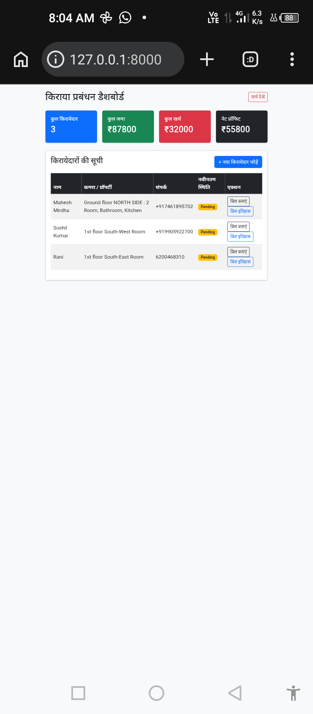
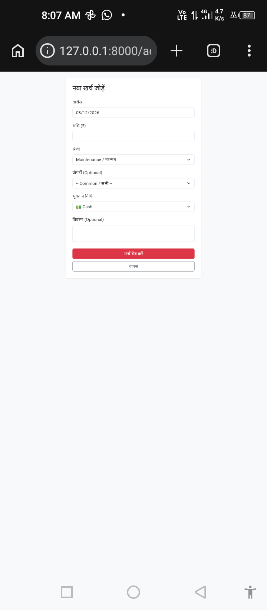
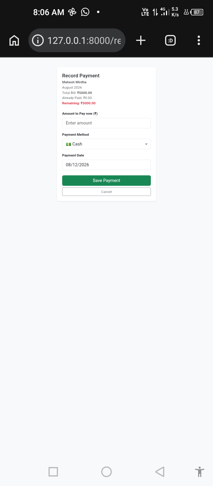
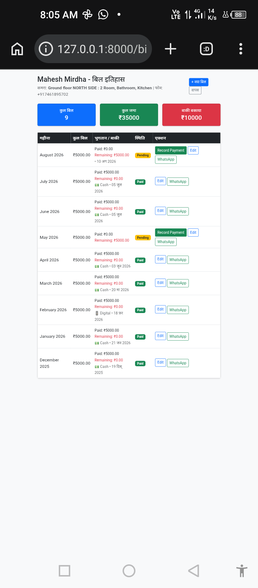

# Tenant & Rent Management System

[]()
[]()
[]()

A lightweight Tenant & Rent Management web application built with Django — designed for small landlords and property owners to manage tenants, billing, and expenses.

## Table of contents

- [Features](#features)
- [Tech stack](#tech-stack)
- [Demo / Screenshots](#demo--screenshots)
- [Requirements](#requirements)
- [Quickstart (Desktop / Linux)](#quickstart-desktop--linux)
- [Installation on Termux (Android)](#installation-on-termux-android)
- [Environment variables](#environment-variables)
- [Docker](#docker)
- [Testing](#testing)
- [Deployment notes](#deployment-notes)
- [Contribution](#contribution)
- [License](#license)
- [Contact](#contact)

---

## Features

- Tenant management: add/view tenants, assign property/room, track advance/security money
- Billing: generate monthly rent + electricity bills, partial payments, payment methods (Cash/Digital), payment editing, WhatsApp bill sharing
- Expense tracking: add daily/monthly expenses, categories, link to property, dashboard totals
- Dashboard: total tenants, collected, pending, total expense, net profit

---

## Tech stack

- **Backend**: Django 5 / 6
- **Database**: SQLite (default). PostgreSQL recommended for production.
- **Frontend**: Bootstrap 5 + HTML
- **Language**: Python 3.10+

---


## Demo / Screenshots

| Dashboard | Add Expense |
| :---: | :---: |
|  |  |

| Expense List | Record Payment |
| :---: | :---: |
|  |  |

| Bill History |
| :---: |
|  |

end


## Demo / Screenshots

Add screenshots to a `docs/` or `screenshots/` folder and link them here. Example:

- docs/screenshots/dashboard.png

---

## Requirements

- Python 3.10+
- pip
- virtualenv (recommended)
- SQLite (default) or PostgreSQL for production
- (Optional) Docker

Add a `requirements.txt` by running:

```bash
python -m pip install --upgrade pip
pip freeze > requirements.txt
```

---

## Quickstart (Desktop / Linux)

1. Clone

```bash
git clone https://github.com/kbulbul026-coder/my-django-app.git
cd my-django-app
```

2. Create and activate a virtual environment

```bash
python -m venv .venv
source .venv/bin/activate
```

3. Install dependencies

```bash
pip install -r requirements.txt
```

4. Create a `.env` (see [Environment variables](#environment-variables)) and run migrations

```bash
python manage.py migrate
python manage.py createsuperuser
```

5. (Optional) Collect static files

```bash
python manage.py collectstatic --no-input
```

6. Run the development server

```bash
python manage.py runserver
# or to bind to all interfaces:
python manage.py runserver 0.0.0.0:8000
```

Visit http://127.0.0.1:8000

---

## Installation on Termux (Android)

Note: Termux environment can differ from standard Linux. These steps are basic; you may need to adapt for dependencies that require compilation.

1. Update Termux & install required packages

```bash
pkg update && pkg upgrade -y
pkg install python git -y
termux-setup-storage   # allow storage access if you will serve static/uploads
```

2. Upgrade pip and create a virtualenv

```bash
python -m pip install --upgrade pip
python -m pip install virtualenv
virtualenv venv
source venv/bin/activate
```

3. Install project dependencies and run migrations

```bash
pip install -r requirements.txt
python manage.py migrate
python manage.py createsuperuser
```

4. Run the app (bind to 0.0.0.0 to access from other devices on the same network)

```bash
python manage.py runserver 0.0.0.0:8000
```

Tips for Termux:

- If you need system libraries (e.g., for Pillow or psycopg2), install build tools: `pkg install clang make openssl-dev libffi-dev zlib-dev` (only if required).
- For persistent background serving, consider using `gunicorn` in a proper server/container rather than Termux for production.

---

## Environment variables

Create a `.env` file (example):

```ini
SECRET_KEY=your-secret-key
DEBUG=True
ALLOWED_HOSTS=localhost,127.0.0.1
DATABASE_URL=sqlite:///db.sqlite3
```

Use django-environ or python-dotenv to load `.env` values in settings.

---

## Docker

Add a `Dockerfile` and `docker-compose.yml` for reproducible deployments. Minimal example usage:

```bash
docker-compose up --build
```

If you'd like, I can add sample Docker files to the repo.

---

## Testing

Run tests with:

```bash
python manage.py test
```

Add CI (GitHub Actions) to run tests and linting on push/PR.

---

## Deployment notes

- Use PostgreSQL in production and set proper DB env vars.
- Use Gunicorn + Nginx for serving static files and production traffic.
- Ensure DEBUG=False, configure ALLOWED_HOSTS, and set secure SECRET_KEY in env vars.
- Configure HTTPS (Let's Encrypt) when exposing to the public web.

---

## Contribution

Contributions are welcome:

1. Fork the repo.
2. Create a feature branch: `git checkout -b feat/your-feature`.
3. Add tests and run them.
4. Open a PR describing your change.

Consider adding a CONTRIBUTING.md for detailed guidelines.

---

## License

This project is provided under the MIT License. See `LICENSE` for details.

---

## Contact

Maintainer: K. Bulbul (kbulbul026-coder) — open issues or PRs on GitHub.
